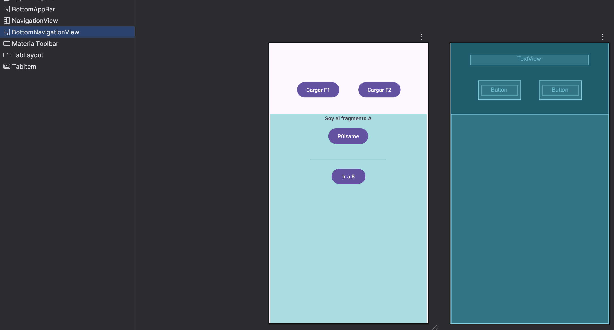

# Bottom Navigation - sin DrawerLayout

1. **Partimos del proyecto de navegación de fragmentos sencillo:**

[https://github.com/aranzabe/Fragmentos](https://github.com/aranzabe/Fragmentos)

---

2. En `activity_main.xml` insertamos el control **BottomNavigationView**:



---

3. Después lo colocamos abajo de la **`activity`**, quedando así:


---

4. **Creamos un menú** como hicimos con el menú de puntos: `new` → `Android Resource File`. Tipo menú y con los valores (nombre: `bottom_nav_menu`):

```jsx
<?xml version="1.0" encoding="utf-8"?>
<menu xmlns:android="http://schemas.android.com/apk/res/android">
    <item
        android:id="@+id/navigation_fragmento_a"
        android:icon="@drawable/ic_fa"
        android:title="" />

    <item
        android:id="@+id/navigation_fragmento_b"
        android:icon="@drawable/ic_fb"
        android:title="" />
</menu>
```

---

5. Insertamos en `activity_main.xml`  una **material tool bar** que será necesaria para que todo esto funcione. Quedando el xml así:

```jsx
<?xml version="1.0" encoding="utf-8"?>
<androidx.constraintlayout.widget.ConstraintLayout xmlns:android="http://schemas.android.com/apk/res/android"
    xmlns:app="http://schemas.android.com/apk/res-auto"
    xmlns:tools="http://schemas.android.com/tools"
    android:id="@+id/main"
    android:layout_width="match_parent"
    android:layout_height="match_parent"
    tools:context=".MainActivity">

    <Button
        android:id="@+id/btCargarF2"
        android:layout_width="wrap_content"
        android:layout_height="wrap_content"
        android:text="Cargar F2"
        app:layout_constraintBottom_toBottomOf="parent"
        app:layout_constraintEnd_toEndOf="parent"
        app:layout_constraintHorizontal_bias="0.775"
        app:layout_constraintStart_toStartOf="parent"
        app:layout_constraintTop_toTopOf="parent"
        app:layout_constraintVertical_bias="0.23" />

    <Button
        android:id="@+id/btnCargarF1"
        android:layout_width="wrap_content"
        android:layout_height="wrap_content"
        android:text="Cargar F1"
        app:layout_constraintBottom_toBottomOf="parent"
        app:layout_constraintEnd_toEndOf="parent"
        app:layout_constraintHorizontal_bias="0.228"
        app:layout_constraintStart_toStartOf="parent"
        app:layout_constraintTop_toTopOf="parent"
        app:layout_constraintVertical_bias="0.23" />

    <FrameLayout
        android:id="@+id/miFragmento"
        android:layout_width="394dp"
        android:layout_height="412dp"
        app:layout_constraintBottom_toBottomOf="parent"
        app:layout_constraintEnd_toEndOf="parent"
        app:layout_constraintHorizontal_bias="0.0"
        app:layout_constraintStart_toStartOf="parent"
        app:layout_constraintTop_toTopOf="parent"
        app:layout_constraintVertical_bias="0.712">

        <androidx.fragment.app.FragmentContainerView
            android:id="@+id/miFragContainer"
            android:name="androidx.navigation.fragment.NavHostFragment"
            android:layout_width="match_parent"
            android:layout_height="match_parent"
            app:defaultNavHost="true"
            app:navGraph="@navigation/mi_nav" />

    </FrameLayout>

    <TextView
        android:id="@+id/txtMain"
        android:layout_width="308dp"
        android:layout_height="26dp"
        android:textAlignment="center"
        app:layout_constraintBottom_toTopOf="@+id/miFragmento"
        app:layout_constraintEnd_toEndOf="parent"
        app:layout_constraintHorizontal_bias="0.494"
        app:layout_constraintStart_toStartOf="parent"
        app:layout_constraintTop_toTopOf="parent"
        app:layout_constraintVertical_bias="0.47" />

    <com.google.android.material.bottomnavigation.BottomNavigationView
        android:id="@+id/miBottomNav"
        android:layout_width="match_parent"
        android:layout_height="90dp"
        android:background="#99BDD1"
        app:layout_constraintBottom_toBottomOf="parent"
        app:layout_constraintEnd_toEndOf="parent"
        app:layout_constraintHorizontal_bias="0.0"
        app:layout_constraintStart_toStartOf="parent"
        app:layout_constraintTop_toBottomOf="@+id/miFragmento"
        app:layout_constraintVertical_bias="1.0"
        app:menu="@menu/bottom_nav_menu" />

    <com.google.android.material.appbar.MaterialToolbar
        android:id="@+id/miMaterialToolBar"
        android:layout_width="match_parent"
        android:layout_height="wrap_content"
        android:background="?attr/colorPrimary"
        android:minHeight="?attr/actionBarSize"
        android:theme="?attr/actionBarTheme"
        app:layout_constraintBottom_toBottomOf="parent"
        app:layout_constraintEnd_toEndOf="parent"
        app:layout_constraintHorizontal_bias="1.0"
        app:layout_constraintStart_toStartOf="parent"
        app:layout_constraintTop_toTopOf="parent"
        app:layout_constraintVertical_bias="0.0" />

</androidx.constraintlayout.widget.ConstraintLayout>
```

Observamos que dentro del bloque de la `bottomnavigation` hemos puesto la línea:

```jsx
app:menu="@menu/bottom_nav_menu"
```

Quedando el bloque:

```jsx
<com.google.android.material.bottomnavigation.BottomNavigationView
        android:layout_width="match_parent"
        android:layout_height="90dp"
        app:layout_constraintBottom_toBottomOf="parent"
        android:background="#99BDD1"
        app:layout_constraintEnd_toEndOf="parent"
        app:layout_constraintHorizontal_bias="0.0"
        app:layout_constraintStart_toStartOf="parent"
        app:layout_constraintTop_toBottomOf="@+id/miFragmento"
        app:menu="@menu/bottom_nav_menu"
        app:layout_constraintVertical_bias="1.0" />
```

---

6. En **`MainActivity.kt`** escribimos el siguiente código:

```jsx
package com.example.bottomnavigation

import android.os.Bundle
import androidx.activity.enableEdgeToEdge
import androidx.activity.viewModels
import androidx.appcompat.app.AppCompatActivity
import androidx.core.view.ViewCompat
import androidx.core.view.WindowInsetsCompat
import androidx.navigation.NavController
import androidx.navigation.fragment.NavHostFragment
import androidx.navigation.ui.AppBarConfiguration
import androidx.navigation.ui.navigateUp
import androidx.navigation.ui.setupActionBarWithNavController
import androidx.navigation.ui.setupWithNavController
import com.example.bottomnavigation.databinding.ActivityMainBinding
import com.google.android.material.bottomnavigation.BottomNavigationView
import kotlin.getValue
import kotlin.toString

class MainActivity : AppCompatActivity() {
    lateinit var binding: ActivityMainBinding
    private val mainViewModel: MainViewModel by viewModels()

    private lateinit var navController: NavController
    private lateinit var appBarConfiguration: AppBarConfiguration

    override fun onCreate(savedInstanceState: Bundle?) {
        super.onCreate(savedInstanceState)
        enableEdgeToEdge()
        //setContentView(R.layout.activity_main)
        binding = ActivityMainBinding.inflate(layoutInflater)
        setContentView(binding.root)

        //Configura la Toolbar como ActionBar
        setSupportActionBar(binding.miMaterialToolBar)
        supportActionBar?.setDisplayHomeAsUpEnabled(false)

        //******************* Para iniciar el navController que me permitirá navegar de un fragmento a otro. Obtener NavController desde NavHostFragment
        val navHostFragment = supportFragmentManager.findFragmentById(R.id.miFragContainer) as NavHostFragment
        navController = navHostFragment.navController

        //*********** Para la Navigation Bottom Bar *****************
        val navView: BottomNavigationView = binding.miBottomNav
        //Pasamos cada ID del menú para que sean tenidos en cuenta como la selección hecha cada vez que pulsamos en uno de ellos.
        //Recuerda que en el xml de main definimos esto 'app:menu="@menu/mi_menu"' para la bottom navigation bar y asociarla.
        appBarConfiguration = AppBarConfiguration(
            setOf(
                R.id.navigation_fragmento_a, R.id.navigation_fragmento_b
            )
        )
        setupActionBarWithNavController(navController, appBarConfiguration)
        navView.setupWithNavController(navController)
        // Evitar que al re-seleccionar la misma opción recargue el fragmento
        navView.setOnItemReselectedListener { /* no-op para evitar reload */ }
        //*********** Para la Navigation Bottom Bar *****************
        //En el archivo mi_nav.xml los id de los fragmentos en el nav_graph debe coincidir con los id de los elementos en mi_menu.xml.
        //Es decir para que funcione esto de arriba los fragmentos se llamarán:
        // -- en mi_nav: navigation_fragmento_a
        // -- en menu: navigation_fragmento_a
        //Lo de aquí abajo es para jugar con el título de la Toolbar. Se dispara automáticamente cuando cambia la navegación de un Fragmento a otro.
        navController.addOnDestinationChangedListener { _, destination, _ ->
            when (destination.id) {
                R.id.navigation_fragmento_a -> {
                    //supportActionBar?.title = "Fragmento A"
                    supportActionBar?.hide()
                }
                R.id.navigation_fragmento_b -> {
                    supportActionBar?.hide()
                    //supportActionBar?.title = "Fragmento B"
                }
            }
        }

        binding.btnCargarF1.setOnClickListener {
            navController.navigate(R.id.navigation_fragmento_a)
        }

        binding.btCargarF2.setOnClickListener {
            navController.navigate(R.id.navigation_fragmento_b)
        }

        mainViewModel.textoCompartido.observe(this) {
            binding.txtMain.text = it
        }

        mainViewModel.myResponseUsuarioMain.observe(this) {
            binding.txtMain.text = it.toString()
        }
    }

    //Importante: permitir que el botón "up" funcione con NavController
    override fun onSupportNavigateUp(): Boolean {
        return navController.navigateUp(appBarConfiguration) || super.onSupportNavigateUp()
    }
}
```

Teniendo en cuenta que `mi_nav.xml` es:

```jsx
<?xml version="1.0" encoding="utf-8"?>
<navigation xmlns:android="http://schemas.android.com/apk/res/android"
    xmlns:app="http://schemas.android.com/apk/res-auto"
    xmlns:tools="http://schemas.android.com/tools"
    android:id="@+id/mi_nav"
    app:startDestination="@id/navigation_fragmento_a">

    <fragment
        android:id="@+id/navigation_fragmento_a"
        android:name="com.example.bottomnavigation.FragmentoA"
        android:label="fragment_fragmento_a"
        tools:layout="@layout/fragment_fragmento_a" >
        <action
            android:id="@+id/action_fragmentoA_to_fragmentoB"
            app:destination="@id/navigation_fragmento_b" />
    </fragment>
    <fragment
        android:id="@+id/navigation_fragmento_b"
        android:name="com.example.bottomnavigation.FragmentoB"
        android:label="fragment_fragmento_b"
        tools:layout="@layout/fragment_fragmento_b" >
        <action
            android:id="@+id/action_fragmentoB_to_fragmentoA"
            app:destination="@id/navigation_fragmento_a" />
    </fragment>
</navigation>
```

Y el menú `bottom_nav_manu.xml`:

```jsx
<?xml version="1.0" encoding="utf-8"?>
<menu xmlns:android="http://schemas.android.com/apk/res/android">
    <item
        android:id="@+id/navigation_fragmento_a"
        android:icon="@drawable/ic_fa"
        android:title="" />

    <item
        android:id="@+id/navigation_fragmento_b"
        android:icon="@drawable/ic_fb"
        android:title="" />
</menu
```

Recuerda que los id’s se deben llamar igual para que al elegir una opción u otra se seleccione el fragmento correcto.

---

7. **Resumen:**

a) Inicializar NavController

```kotlin
val navHostFragment = supportFragmentManager.findFragmentById(R.id.miFragContainer) as NavHostFragment
navController = navHostFragment.navController
```

Buscas el `NavHostFragment` que está en tu layout (un `<fragment>` con `android:name="androidx.navigation.fragment.NavHostFragment"`). Desde ahí obtienes el `NavController`. Esto es correcto y estándar.

b) BottomNavigationView y conexión con NavController:

```kotlin
val navView: BottomNavigationView = binding.miBottomNav
val appBarConfiguration = AppBarConfiguration(setOf(R.id.navigation_fragmento_a, R.id.navigation_fragmento_b))
setupActionBarWithNavController(navController, appBarConfiguration)
navView.setupWithNavController(navController)
navView.setOnItemReselectedListener { /* no-op para evitar reload */ }
```

- `appBarConfiguration` define las **destinations top-level** (las que no muestran flecha "up" cuando estás en ellas). Aquí indicas que `fragmento_a` y `fragmento_b` son top-level.
- `setupActionBarWithNavController` sincroniza la `ActionBar` con el `NavController` (título y comportamiento del botón up).
- `navView.setupWithNavController(navController)` hace la magia: cuando el usuario pulsa un item del bottom nav, `NavController` navega al fragmento correspondiente y mantiene sincronizado el selector del BottomNavigationView. **Requisito**: los `id` del menú del BottomNav deben coincidir con los ids de los destinos del nav_graph.
- `navView.setOnItemReselectedListener **{** /* no-op para evitar reload */ **}`** 
evita que al re-seleccionar la misma opción recargue el fragmento

c) Escuchador de cambios de destino:

```kotlin
navController.addOnDestinationChangedListener { _, destination, _ ->
    when (destination.id) {
        R.id.navigation_fragmento_a -> { supportActionBar?.hide() }
        R.id.navigation_fragmento_b -> { supportActionBar?.hide() }
    }
}
```

Esto se ejecuta cada vez que cambias de fragmento. Tú ocultas la `ActionBar` en ambos casos. Está bien si ese es tu objetivo (p. ej. si manejas un `Toolbar` dentro de los fragments o no quieres mostrar la barra). Si quieres que la `ActionBar` muestre títulos automáticamente, puedes **no ocultarla** y dejar que `setupActionBarWithNavController` lo gestione.